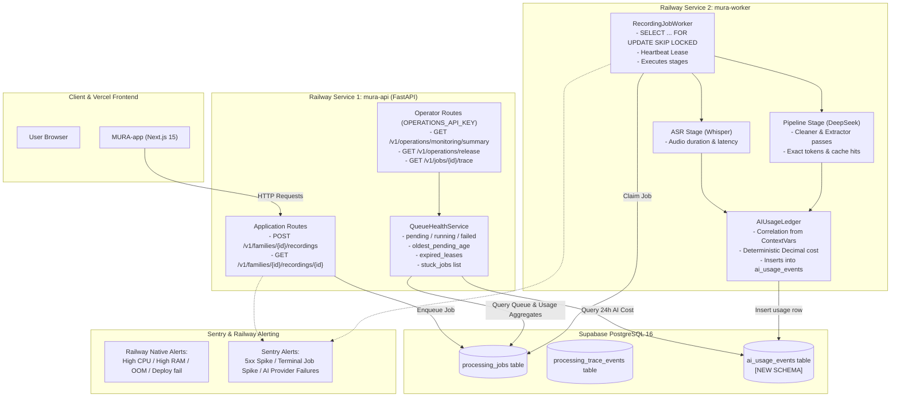

# MURA Production Phase 1.5 — Monitoring, AI Usage, Cost Tracking & Alerts Implementation Plan

## 1. Executive Summary & Philosophy

Phase 1.5 builds the production operational monitoring layer on top of Phase 1.4's structured logging, correlation IDs, and Sentry error tracking.
Per the architectural constraints:
- **No Heavy External Infrastructure**: We will NOT introduce Prometheus, Grafana, Grafana Alloy, Datadog, New Relic, Redis, or Celery.
- **Three-Tier Monitoring Responsibility**:
  1. **Railway Native Observability**: Container CPU, RAM, Network Egress/Ingress, Disk, Restarts, Deployment health.
  2. **Sentry**: Application exceptions, route transaction performance, Web Vitals, and alerting.
  3. **MURA Database (PostgreSQL)**: Durable queue health, stuck jobs, stage traces, and durable AI usage ledger.
- **Strict Privacy Guarantees**: Monitoring NEVER collects, stores, or emits audio bytes, transcript text, family names, person names, quotes, prompts, LLM outputs, or auth tokens.

---

## 2. Audit of Existing Monitoring & Telemetry

### 2.1 Available from Railway Native Observability
- **CPU Usage**: Real-time and historical percentage of assigned vCPU limits for `mura-api` and `mura-worker`.
- **RAM Usage**: Resident memory in MB and percentage of allocation limit. Crucial for detecting memory leaks in audio processing.
- **Network I/O**: Network egress and ingress bandwidth (MB/s).
- **Process Restarts & OOM Kills**: Crash tracking and exit status codes.
- **Deployment Status**: Build status, deploy hooks (`alembic upgrade head`), and active revisions.

### 2.2 Available from Sentry (Phase 1.4)
- **API Performance**: Request durations, transaction p50, p75, p95, p99 across HTTP routes (with health probes filtered to `0.0`).
- **HTTP Error Rate**: Tracking of all 500+ unhandled exceptions via `handle_unhandled_exception`.
- **Worker Terminal Errors**: Captures terminal job failures (`asr_failed`, `pipeline_failed`) via `capture_exception` with safe tags (`job_id`, `recording_id`, `attempt`).
- **Frontend Errors & Web Vitals**: React error boundaries (`error.tsx`, `global-error.tsx`), server component errors via `instrumentation.ts` (`onRequestError`).

### 2.3 Available from Existing MURA Database Schema
- `processing_jobs`:
  - Indexed columns: `status`, `next_attempt_at`, `lease_owner`, `lease_expires_at`, `recording_id`.
  - Timestamp tracking: `created_at`, `started_at`, `completed_at`, `last_heartbeat_at`, `updated_at`.
  - Failure info: `attempts`, `error_code`, `error_detail`.
- `processing_trace_events`:
  - Structured stage records (`stage`, `event_name`, `outcome`, `duration_ms`, `sequence`, `attributes`).
- `pipeline_results`:
  - `payload["processing"]["total_seconds"]`
  - `payload["processing"]["cleaner_usage"]` (stores `prompt_tokens`, `completion_tokens`, `total_tokens`, `prompt_cache_hit_tokens`, `prompt_cache_miss_tokens`, `request_seconds`)
  - `payload["processing"]["extractor_usage"]`

### 2.4 Actual Provider Response Parsing Audit
- **DeepSeek** (`src/mura/deepseek/client.py`):
  - Directly returns `DeepSeekUsage`:
    - `prompt_tokens`
    - `completion_tokens`
    - `total_tokens`
    - `prompt_cache_hit_tokens`
    - `prompt_cache_miss_tokens`
    - `model`
    - `finish_reason`
    - `request_seconds` (wall-clock latency)
  - No token fabrication needed; fields are provided directly by DeepSeek chat completion API.
- **Whisper** (`src/mura/asr/whisper.py`):
  - Returns `TranscriptEnvelope`:
    - `duration_seconds` (exact audio duration from Whisper or segments)
    - `asr_model`
    - `asr_revision`
  - Billed by audio minutes/seconds (\$0.006/minute for Whisper-1), NOT by tokens.
  - Latency can be measured with `time.perf_counter()`.

### 2.5 What Is Missing
1. **Durable AI Usage Ledger**: Failed calls, retries, individual cleaning/extraction passes, and ASR calls are not recorded in a queryable table. `pipeline_results` only holds finished successful recordings as unstructured JSONB blobs.
2. **Centralized Cost Model**: No versioned pricing engine or deterministic `Decimal` cost calculator.
3. **Queue Health & Stuck Job Queries**: No pre-built queries to aggregate queue depth, oldest pending age, expired leases, or stuck job candidates.
4. **Operator Visibility Endpoint**: No privileged endpoint exposing system health aggregates to operators without direct DB access.

---

## 3. Architecture & Data Flow



---

## 4. Proposed Database Changes (Alembic Migration)

Create migration `20260917_0012_ai_usage_ledger.py`:

```sql
CREATE TABLE ai_usage_events (
    event_id VARCHAR(64) PRIMARY KEY,
    created_at TIMESTAMPTZ NOT NULL,
    provider VARCHAR(64) NOT NULL,
    model VARCHAR(64) NOT NULL,
    operation VARCHAR(64) NOT NULL,
    request_id VARCHAR(64) NULL,
    job_id VARCHAR(64) NULL,
    recording_id VARCHAR(64) NULL,
    family_id VARCHAR(128) NULL,
    input_tokens INTEGER NULL,
    output_tokens INTEGER NULL,
    cached_input_tokens INTEGER NULL,
    audio_seconds NUMERIC(10, 3) NULL,
    latency_ms INTEGER NOT NULL,
    success BOOLEAN NOT NULL,
    attempt INTEGER NOT NULL DEFAULT 1,
    error_code VARCHAR(64) NULL,
    estimated_cost_usd NUMERIC(12, 6) NULL,
    pricing_version VARCHAR(64) NULL
);

CREATE INDEX ix_ai_usage_events_created_at ON ai_usage_events (created_at);
CREATE INDEX ix_ai_usage_events_provider_model ON ai_usage_events (provider, model);
CREATE INDEX ix_ai_usage_events_job_id ON ai_usage_events (job_id);
CREATE INDEX ix_ai_usage_events_recording_id ON ai_usage_events (recording_id);
```

### Justification of Indexes:
- `created_at`: For time-window queries (e.g. 24-hour usage and cost aggregates).
- `(provider, model)`: For breakdown of spend by model.
- `job_id` and `recording_id`: For fast incident triage and debugging of specific recordings.

---

## 5. Centralized Cost Model (`mura.cost`)

### Design:
- Pricing configured in a centralized structure `AIModelPricing` with `pricing_version`:
  ```python
  @dataclass(frozen=True)
  class ModelPricingRate:
      pricing_version: str
      input_rate_per_million: Decimal | None = None
      cached_input_rate_per_million: Decimal | None = None
      output_rate_per_million: Decimal | None = None
      audio_rate_per_second: Decimal | None = None
  ```
- Standard pricing registry:
  - DeepSeek (`deepseek-v4-flash`, `deepseek-chat`, `deepseek-v3`):
    - Input (cache miss): \$0.27 / 1M
    - Input (cache hit): \$0.07 / 1M
    - Output: \$1.10 / 1M
  - DeepSeek (`deepseek-v4-pro`, `deepseek-reasoner`):
    - Input: \$0.55 / 1M
    - Output: \$2.19 / 1M
  - Whisper (`whisper-1`):
    - Audio: \$0.006 / minute = \$0.0001 / second
- **Strict Invariants**:
  - Always uses `Decimal` arithmetic for financial precision.
  - If a model or provider has no defined pricing, `estimated_cost_usd` is `None` and `pricing_version` is `None`. **Never fabricate costs.**

---

## 6. Queue Health & Stuck Job Detection

### Definition of "Stuck" Job:
1. **Oldest Pending Threshold Exceeded**: A job in `status == 'queued'` whose `created_at` is older than `stuck_pending_threshold_seconds` (default: 600s / 10m).
2. **Expired Lease on Active Job**: A job in an active non-terminal status (`transcribing`, `cleaning`, `extracting`, `resolving`) where `lease_expires_at < now - grace_seconds` (default grace: 60s). This indicates a worker process crashed or froze without renewing its lease.
3. **Repeated Failure / Retry Exhaustion**: A job with `attempts >= 3` that failed or is deferred.

### Safe Querying:
- Single SQL queries utilizing existing indexes `ix_processing_jobs_status` and `ix_processing_jobs_lease_expires_at`.
- Zero table lock contention: all monitoring reads use standard non-locking `SELECT` queries with appropriate predicates.
- Monitoring is purely read-only: it detects and reports stuck jobs without mutative side effects.

---

## 7. Operator Visibility Endpoint (`/v1/operations/monitoring/summary`)

Add to `apps/api/operations.py`:
- Method: `GET`
- Route: `/v1/operations/monitoring/summary`
- Protection: `operations_token_dependency` (`OPERATIONS_API_KEY`).
- Blocked by frontend proxy allowlist: The browser/client cannot reach this endpoint.
- Response Envelope:
```json
{
  "timestamp": "2026-09-17T15:30:00.000Z",
  "queue": {
    "pending": 0,
    "running": 1,
    "failed": 0,
    "oldest_pending_seconds": null,
    "expired_leases": 0
  },
  "pipeline_24h": {
    "completed": 12,
    "failed": 0
  },
  "ai_24h": {
    "requests_count": 36,
    "input_tokens": 98400,
    "output_tokens": 22100,
    "cached_input_tokens": 71200,
    "audio_seconds": 960.5,
    "estimated_cost_usd": "0.124500"
  },
  "stuck_jobs": []
}
```

---

## 8. Exact Files to Modify / Create

1. `Mura_project/src/mura/cost.py` [NEW]:
   - Pricing registry, `Decimal` pricing calculations, versioned pricing tags.
2. `Mura_project/src/mura/storage/ai_usage.py` [NEW]:
   - SQLAlchemy `AIUsageEventRow`, Pydantic models, and `AIUsageLedger` repository.
3. `Mura_project/migrations/versions/20260917_0012_ai_usage_ledger.py` [NEW]:
   - Alembic migration creating `ai_usage_events` table and indexes.
4. `Mura_project/src/mura/monitoring.py` [NEW]:
   - `QueueHealthService` querying queue depth, 24h stats, and detecting stuck jobs.
5. `Mura_project/src/mura/deepseek/client.py` [MODIFY]:
   - Add usage callback hook / listener to `DeepSeekClient` to capture request latency, model, tokens, cache hits, attempt, and error code.
6. `Mura_project/src/mura/asr/whisper.py` [MODIFY]:
   - Capture transcription duration, latency, and emit usage record.
7. `Mura_project/src/mura/orchestration/recordings.py` [MODIFY]:
   - Connect usage reporting to `AIUsageLedger` in `RecordingJobWorker` using active correlation ContextVars (`job_id_ctx`, `recording_id_ctx`, etc.).
8. `Mura_project/apps/api/operations.py` [MODIFY]:
   - Register `GET /v1/operations/monitoring/summary` protected by `operations_token_dependency`.
9. `Mura_project/apps/api/main.py` [MODIFY]:
   - Wire `QueueHealthService` into runtime.
10. `Mura_project/tests/test_ai_cost_and_usage.py` [NEW]:
    - Unit tests for cost calculation, decimal precision, missing pricing, and ledger persistence.
11. `Mura_project/tests/test_queue_health_monitoring.py` [NEW]:
    - Tests for queue health stats, oldest pending age, expired leases, and stuck job detection.
12. `Mura_project/tests/test_operations_monitoring_api.py` [NEW]:
    - Tests for operator endpoint authorization (401 without key, 200 with key, no PII leakage).
13. `MONITORING.md` [NEW]:
    - Comprehensive production runbook, Railway alerts, Sentry alerts, and incident playbooks.
14. `RAILWAY_DEPLOYMENT.md` [MODIFY]:
    - Cross-reference `MONITORING.md`.
15. `OBSERVABILITY.md` [MODIFY]:
    - Cross-reference `MONITORING.md`.

---

## 9. Verification & Test Plan

1. **Automated Unit & Integration Tests**:
   - `test_ai_cost_and_usage.py`:
     - Test known pricing calculation matches expected Decimal values.
     - Test cache hit/miss weighting.
     - Test unknown model pricing yields `estimated_cost_usd = None`.
     - Test raw usage persists without prompt or response bodies.
   - `test_queue_health_monitoring.py`:
     - Test queue depth counts by status.
     - Test oldest pending age calculation.
     - Test expired lease detection based on `lease_expires_at < now`.
     - Test stuck job classification based on thresholds.
   - `test_operations_monitoring_api.py`:
     - Test unauthorized requests return 401.
     - Test authorized requests return complete aggregate JSON.
     - Verify payload has zero private family data (transcripts, names, stories).
2. **Regression Test Suites**:
   - Backend pytest suite: verify all existing 108+ tests pass.
   - Frontend vitest suite: verify 471 tests in `MURA-app` pass.
   - Frontend build: verify `next build` compiles cleanly.

